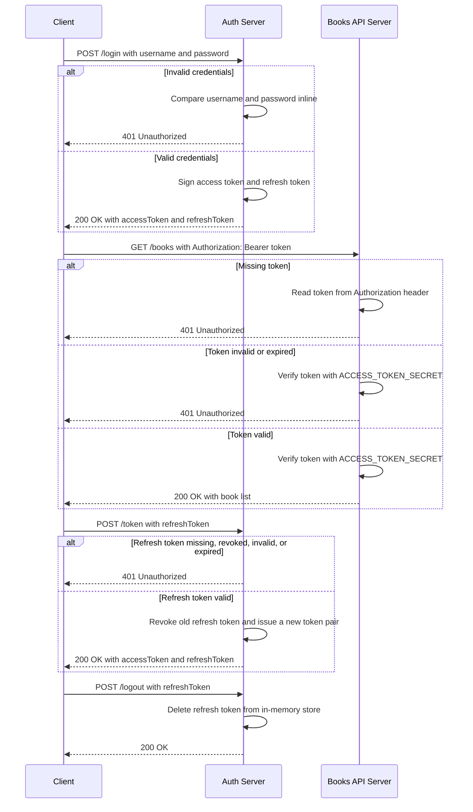

# JWT Express Demo

A small Express app that demonstrates logging in with hard-coded credentials, issuing a JSON Web Token (JWT), and using that token to access a protected `/books` endpoint.

## Table of Contents

- [Requirements](#requirements)
- [Setup](#setup)
- [Running the Server](#running-the-server)
- [API Usage](#api-usage)
- [Request Flow](#request-flow)
- [Project Structure](#project-structure)
- [Notes](#notes)

## Requirements

- Node.js
- pnpm
- `curl` and `jq` for the command-line examples

## Setup

Install dependencies:

```bash
pnpm install
```

Create a local `.env` file from the sample:

```bash
cp .env.sample .env
```

Update `.env` with your own JWT secrets:

```bash
ACCESS_TOKEN_SECRET=replace-with-a-long-random-secret
REFRESH_TOKEN_SECRET=replace-with-another-long-random-secret
```

## Running the Server

Start the auth server:

```bash
pnpm auth
```

The auth server listens on port `5500`.

In another terminal, start the books API server:

```bash
pnpm dev
```

The books API server listens on port `3001`.

## API Usage

### Log In

Use the demo credentials to request an access token and refresh token:

```bash
LOGIN_RESPONSE=$(curl -s --json '{"username":"thangphan","password":"abc"}' \
  http://localhost:5500/login)

ACCESS_TOKEN=$(echo "$LOGIN_RESPONSE" | jq -r ".accessToken")
REFRESH_TOKEN=$(echo "$LOGIN_RESPONSE" | jq -r ".refreshToken")
```

Print the tokens:

```bash
echo "$ACCESS_TOKEN"
echo "$REFRESH_TOKEN"
```

### Access Protected Books Endpoint

Pass the token in the `Authorization` header:

```bash
curl -s -H "Authorization: Bearer $ACCESS_TOKEN" \
  http://localhost:3001/books | jq
```

Successful responses return the protected book list:

```json
{
  "status": "Success",
  "data": {
    "books": [
      {
        "id": 1,
        "name": "Spiderman",
        "author": "Thang"
      },
      {
        "id": 2,
        "name": "Startwars",
        "author": "Ngoc"
      }
    ]
  }
}
```

### Refresh Access Token

After the access token expires, use the refresh token to request a new access token and rotated refresh token:

```bash
REFRESH_RESPONSE=$(curl -s --json "{\"refreshToken\":\"$REFRESH_TOKEN\"}" \
  http://localhost:5500/token)

ACCESS_TOKEN=$(echo "$REFRESH_RESPONSE" | jq -r ".accessToken")
REFRESH_TOKEN=$(echo "$REFRESH_RESPONSE" | jq -r ".refreshToken")
```

The previous refresh token is revoked after rotation. Use the latest refresh token for the next refresh request.

### Log Out

Revoke the active refresh token:

```bash
curl -s --json "{\"refreshToken\":\"$REFRESH_TOKEN\"}" \
  http://localhost:5500/logout | jq
```

## Request Flow



## Project Structure

```text
.
├── .env.sample
├── auth-server.js
├── index.js
├── package.json
├── pnpm-lock.yaml
└── README.md
```

## Notes

- Demo login credentials are `thangphan` / `abc`.
- Access tokens expire after `30` seconds.
- Refresh tokens expire after `1` day and are stored in memory, so they are cleared when the auth server restarts.
- Refresh tokens rotate on every successful `POST /token` request; the previous refresh token stops working immediately.
- This project is for learning JWT request flow only. Do not use hard-coded credentials or short secrets in production.
